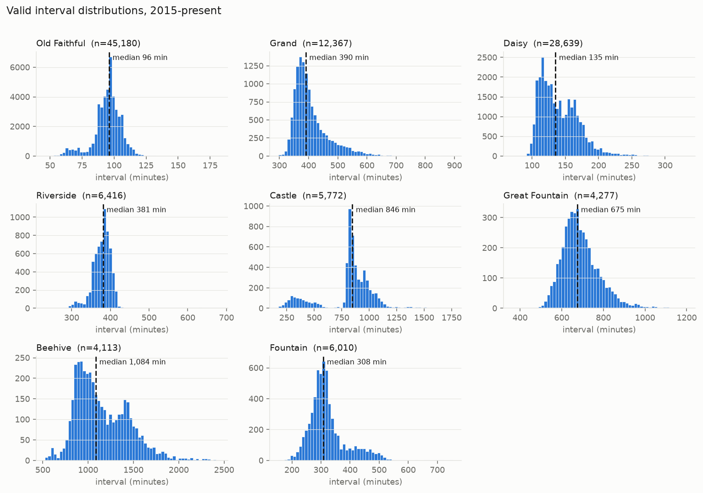
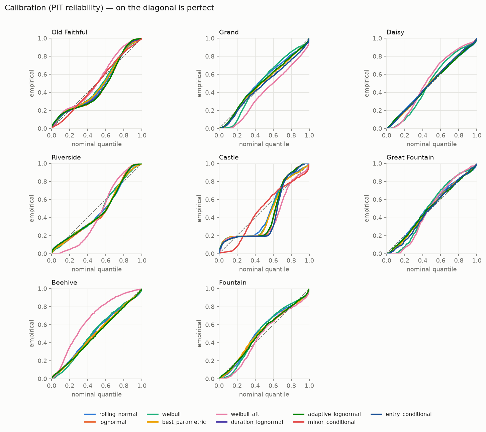
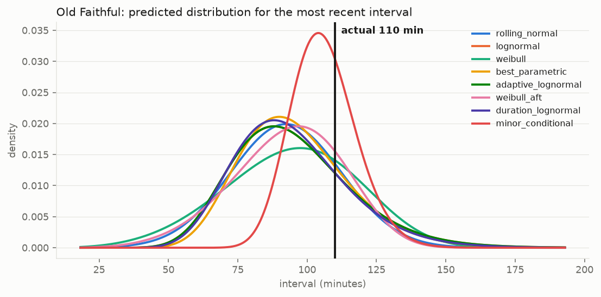

# Calibration report

Walk-forward backtest, last 3 years. Generated 2026-08-09 from the GeyserTimes complete archive.

At every evaluated eruption each model sees **only** intervals strictly earlier than the one it is predicting. All models are scored on the same set of target eruptions, so no model benefits from skipping hard cases.

## Metrics

- **CRPS** (minutes, lower is better) — proper scoring rule over the whole predicted distribution.
- **MAE** (minutes) — absolute error of the predicted median.
- **50% / 90%** — empirical coverage of the nominal intervals. Closer to 50% / 90% is better; `·` marks a miss over 5 points, `⚠` over 10.

| Geyser | Model | n | CRPS (min) | MAE (min) | 50% cov | 90% cov |
|---|---|---:|---:|---:|---:|---:|
| Old Faithful | **minor_conditional** | 2,000 | 4.7 | 6.4 | 57.5% · | 92.8% |
| Old Faithful | duration_lognormal | 2,000 | 8.2 | 11.6 | 54.5% | 89.8% |
| Old Faithful | best_parametric | 2,000 | 8.9 | 12.4 | 54.1% | 90.7% |
| Old Faithful | weibull | 2,000 | 8.9 | 12.2 | 55.9% · | 90.5% |
| Old Faithful | weibull_aft | 2,000 | 9.1 | 12.2 | 61.9% ⚠ | 91.5% |
| Old Faithful | lognormal | 2,000 | 9.1 | 12.9 | 54.2% | 89.9% |
| Old Faithful | rolling_normal | 2,000 | 9.1 | 12.6 | 53.8% | 89.3% |
| Old Faithful | adaptive_lognormal | 2,000 | 9.2 | 12.9 | 54.6% | 89.9% |
| Grand | **adaptive_lognormal** | 2,000 | 38.9 | 54.4 | 47.4% | 90.5% |
| Grand | rolling_normal | 2,000 | 39.4 | 55.1 | 49.0% | 90.8% |
| Grand | lognormal | 2,000 | 39.4 | 55.3 | 46.9% | 91.1% |
| Grand | best_parametric | 2,000 | 40.0 | 56.1 | 46.2% | 91.2% |
| Grand | weibull | 2,000 | 40.8 | 56.0 | 61.9% ⚠ | 93.0% |
| Grand | entry_conditional | 2,000 | 42.1 | 58.7 | 45.7% | 89.4% |
| Grand | weibull_aft | 2,000 | 47.0 | 63.1 | 55.4% · | 86.7% |
| Daisy | **adaptive_lognormal** | 2,000 | 3.1 | 4.3 | 51.3% | 88.1% |
| Daisy | lognormal | 2,000 | 3.1 | 4.3 | 53.5% | 90.3% |
| Daisy | rolling_normal | 2,000 | 3.2 | 4.3 | 49.9% | 87.1% |
| Daisy | best_parametric | 2,000 | 3.2 | 4.4 | 53.8% | 90.8% |
| Daisy | entry_conditional | 2,000 | 3.4 | 4.7 | 53.3% | 90.5% |
| Daisy | weibull | 2,000 | 3.5 | 4.3 | 68.4% ⚠ | 93.8% |
| Daisy | weibull_aft | 2,000 | 5.1 | 6.8 | 67.2% ⚠ | 95.5% · |
| Riverside | **adaptive_lognormal** | 1,576 | 12.8 | 17.5 | 53.4% | 91.1% |
| Riverside | best_parametric | 1,576 | 12.8 | 17.5 | 54.8% | 91.1% |
| Riverside | lognormal | 1,576 | 12.9 | 17.8 | 56.8% · | 92.1% |
| Riverside | rolling_normal | 1,576 | 12.9 | 17.3 | 51.7% | 90.4% |
| Riverside | weibull | 1,576 | 14.2 | 17.4 | 54.1% | 91.9% |
| Riverside | weibull_aft | 1,576 | 18.6 | 22.7 | 77.8% ⚠ | 99.2% · |
| Castle | **minor_conditional** | 865 | 77.6 | 101.6 | 60.8% ⚠ | 87.2% |
| Castle | weibull | 865 | 172.4 | 221.1 | 63.6% ⚠ | 81.0% · |
| Castle | best_parametric | 865 | 173.0 | 223.1 | 63.2% ⚠ | 81.6% · |
| Castle | rolling_normal | 865 | 174.0 | 224.6 | 64.2% ⚠ | 83.5% · |
| Castle | weibull_aft | 865 | 178.3 | 248.7 | 51.4% | 77.3% ⚠ |
| Castle | lognormal | 865 | 186.5 | 259.9 | 66.6% ⚠ | 87.1% |
| Castle | entry_conditional | 865 | 186.7 | 267.8 | 65.3% ⚠ | 87.3% |
| Castle | adaptive_lognormal | 865 | 187.6 | 259.4 | 66.6% ⚠ | 87.2% |
| Great Fountain | **lognormal** | 408 | 45.6 | 62.9 | 55.1% · | 91.2% |
| Great Fountain | best_parametric | 408 | 45.7 | 63.0 | 55.9% · | 91.9% |
| Great Fountain | entry_conditional | 408 | 46.0 | 63.1 | 58.3% · | 93.4% |
| Great Fountain | adaptive_lognormal | 408 | 46.0 | 63.9 | 53.2% | 90.2% |
| Great Fountain | rolling_normal | 408 | 46.4 | 63.4 | 54.7% | 89.5% |
| Great Fountain | weibull | 408 | 48.6 | 63.9 | 71.6% ⚠ | 95.3% · |
| Great Fountain | weibull_aft | 408 | 48.8 | 63.8 | 74.0% ⚠ | 97.1% · |
| Beehive | **rolling_normal** | 1,174 | 119.8 | 166.1 | 51.7% | 87.5% |
| Beehive | adaptive_lognormal | 1,174 | 120.1 | 166.3 | 52.6% | 87.5% |
| Beehive | lognormal | 1,174 | 123.5 | 171.2 | 51.4% | 87.6% |
| Beehive | weibull | 1,174 | 125.3 | 174.3 | 56.6% · | 90.9% |
| Beehive | best_parametric | 1,174 | 126.3 | 176.7 | 50.9% | 88.4% |
| Beehive | weibull_aft | 1,174 | 169.4 | 248.2 | 48.5% | 94.4% |
| Fountain | **adaptive_lognormal** | 707 | 35.2 | 48.4 | 52.5% | 86.8% |
| Fountain | rolling_normal | 707 | 35.7 | 49.2 | 55.2% · | 88.8% |
| Fountain | lognormal | 707 | 36.4 | 50.8 | 50.9% | 88.4% |
| Fountain | best_parametric | 707 | 37.3 | 52.1 | 51.1% | 88.0% |
| Fountain | weibull | 707 | 37.8 | 52.4 | 59.8% · | 91.2% |
| Fountain | weibull_aft | 707 | 38.4 | 52.1 | 61.0% ⚠ | 89.1% |

**Bold** = best CRPS for that geyser.

## Which model wins

| Geyser | Best by CRPS | CRPS | Baseline CRPS | Improvement |
|---|---|---:|---:|---:|
| Old Faithful | minor_conditional | 4.7 | 9.1 | 48.6% |
| Grand | adaptive_lognormal | 38.9 | 39.4 | 1.3% |
| Daisy | adaptive_lognormal | 3.1 | 3.2 | 1.3% |
| Riverside | adaptive_lognormal | 12.8 | 12.9 | 1.3% |
| Castle | minor_conditional | 77.6 | 174.0 | 55.4% |
| Great Fountain | lognormal | 45.6 | 46.4 | 1.8% |
| Beehive | rolling_normal | 119.8 | 119.8 | 0.0% |
| Fountain | adaptive_lognormal | 35.2 | 35.7 | 1.3% |

## Known gaps

- **Castle** — the best model (`minor_conditional`) is far too wide: its nominal 50% interval actually covers 61%. The predicted distribution is the wrong *shape*, not just the wrong width.

- **The covariate model did not earn its complexity.** `weibull_aft` (lifelines Weibull AFT with previous-interval, clock-time, seasonal and entry-flag covariates) ranks in the bottom half on 8 of 8 geysers: Old Faithful 5/8, Grand 7/7, Daisy 7/7, Riverside 6/6, Castle 5/8, Great Fountain 7/7, Beehive 6/6, Fountain 6/6. The simple rolling lognormal/Weibull fits beat it nearly everywhere, and the dashboard-style baseline is competitive. Reported as-is.

### Honest coverage: scoring the intervals the filter throws away

Everything above is measured only on intervals that passed the validity filter, which quietly excludes exactly the cases the filter exists to remove — stretches where an eruption went unlogged. A gazer on the boardwalk gets no such exemption. The table below re-scores a plain rolling `lognormal` (trained only on valid history, as always) against **every** interval in the window, so the gap between the two numbers is the honest cost of observation gaps.

| Geyser | n (all) | % filter-rejected | 50% cov | 90% cov | 90% cov (filtered) |
|---|---:|---:|---:|---:|---:|
| Old Faithful | 1,500 | 13.3% | 46.6% | 76.5% | 89.9% |
| Grand | 1,500 | 18.9% | 38.2% | 74.0% | 91.1% |
| Daisy | 1,500 | 21.0% | 43.4% | 71.1% | 90.3% |
| Riverside | 1,500 | 37.4% | 35.5% | 57.7% | 92.1% |
| Castle | 1,240 | 30.2% | 51.0% | 73.0% | 87.1% |
| Great Fountain | 719 | 43.3% | 31.3% | 51.7% | 91.2% |
| Beehive | 1,279 | 8.2% | 47.2% | 80.4% | 87.6% |
| Fountain | 1,307 | 45.9% | 27.5% | 47.8% | 88.4% |

The drop between the last two columns is the real-world penalty. Treat the headline table as an upper bound on field reliability, and see the renewal/missed-eruption handling in `predict` (README) for how the CLI compensates at prediction time.

## Neighbour-geyser conditioning (nowcast)

The interval harness above asks *how long is the gap after this eruption*. That cannot express what actually helps a gazer — *standing here now, with Beehive's Indicator running, when does it go?* — so these are scored from decision times on a fixed 30-minute grid, independent of when eruptions happen. Scoring only just-before-an-eruption would be conditioning on the answer.

Each decision time is scored **twice, identically**, with neighbour conditioning on and off. Only a paired delta is meaningful here: the conditioned moments are not a random sample of time.

| Geyser | Regime | n | CRPS off | CRPS on | Δ | 90% off | 90% on |
|---|---|---:|---:|---:|---:|---:|---:|
| Grand | **overall** | 21,410 | 44.4 | 44.5 | +0.2% | 90% | 90% |
| Grand | base | 18,008 | 43.7 | 43.7 | +0.0% | 90% | 90% |
| Grand | precursor_shifted | 1,686 | 53.5 | 54.3 | +1.5% | 87% | 86% |
| Grand | turban_gated | 1,716 | 42.3 | 42.4 | +0.2% | 93% | 92% |
| Beehive | **overall** | 30,708 | 118.2 | 114.9 | -2.8% | 86% | 89% |
| Beehive | base | 28,667 | 116.2 | 116.1 | -0.0% | 90% | 90% |
| Beehive | indicator_active | 2,041 | 147.1 | 97.6 | -33.7% | 30% | 87% |

**Beehive's Indicator works.** In the minutes it is running, CRPS falls by about a third and nominal 90% coverage goes from badly overconfident to roughly honest. The no-Indicator regime is untouched, which is the point — the conditioning adds information only when there is information to add. Residual error in that regime is dominated by cycles where the Beehive eruption itself was never logged (~6% of Indicator entries), not by the model.

**Grand's Turban lattice does not work, and is off by default.** Grand starts *with* a Turban — only 0.1% of starts fall 5-13 minutes after one, against 24% in the first two minutes — so gating the density onto that lattice looks obviously right. It isn't. Turban's own interval scatters (sd 4.2 min on a 19 min period) so extrapolated phase decoheres within about one cycle, and Grand's own uncertainty is ~100 min, five times the Turban period. The model's predicted median never drops below 40 minutes, so the lattice is never consulted at a range where it could discriminate. Rift and West Triplet shifts (+32 and +15 min, both highly significant under a length-bias-safe test) likewise fail to improve the distribution. Both are kept switchable so the negative result stays reproducible.

## Figures

## Data-quality notes

- Of 1,340,410 consecutive-eruption gaps, 1,008,658 (75.2%) pass the per-geyser plausibility filter (0.35x-3x that geyser's median). The rest are overwhelmingly observation gaps — nobody is watching Riverside at 3am in February — not real eruptions.

- The ceiling is **1.75x** the median rather than the more obvious 3x because the interval histograms show clear **harmonics**: Riverside clusters at ~390, ~780 and ~1150 minutes, Great Fountain at ~686 and ~1400. Those secondary peaks sit at exactly 2x and 3x the median and are one and two missed eruptions. A 3x ceiling admits them, and models trained on the contaminated series predict distributions far wider than reality — it was worth several times more CRPS than any modeling choice in this report.

Observation-entry mix since 2015 (% of valid intervals):

| Geyser | webcam | electronic | approximate | in-eruption |
|---|---:|---:|---:|---:|
| Beehive | 48.2% | 1.2% | 1.5% | 2.7% |
| Castle | 48.7% | 20.2% | 1.1% | 11.2% |
| Daisy | 58.2% | 24.2% | 0.6% | 6.9% |
| Fountain | 0.0% | 57.1% | 0.7% | 5.2% |
| Grand | 45.8% | 15.5% | 1.2% | 5.2% |
| Great Fountain | 0.0% | 62.5% | 0.8% | 2.6% |
| Old Faithful | 91.1% | 3.8% | 0.3% | 3.4% |
| Riverside | 62.0% | 1.1% | 1.2% | 21.9% |

Data courtesy of [GeyserTimes.org](https://geysertimes.org) and its community of volunteer observers.
